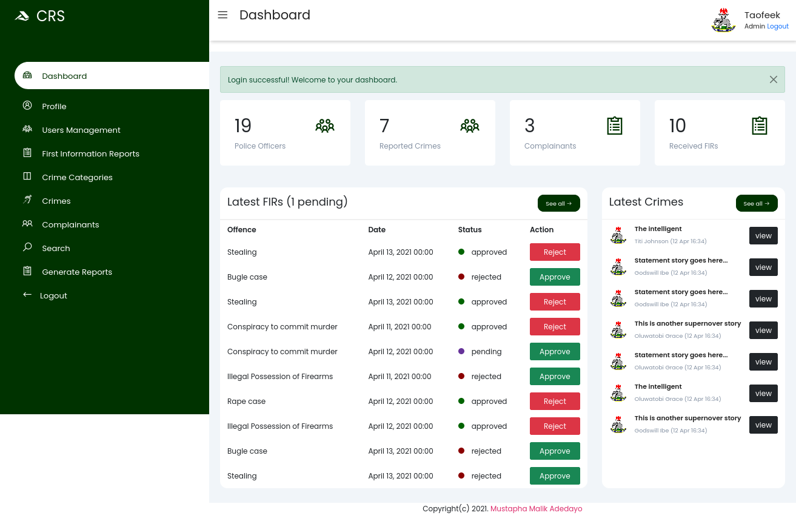

## Crime Record System

> An all-in-one crime monitoring system, using a police station as a case study.
> It can be used by 2 categories of users: admin & police officer.
> It consists of users management, First Information Reports management, Crimes management, search and reporting features, etc.

## Built With:
- Ruby on Rails 6.1
  Ruby 2.7.1
- PostgreSQL
  HTML/CSS/Bootstrap 5
- Heroku
- Git/GitHub GitFlow
- RubyMine
- Cloudinary (Image storage)




### Demo URL: https://crime-monitoring.herokuapp.com/

## Getting Started
### Setup
To setup this project on your development environment, follow the steps below:
- On the project GitHub page, navigate to the main page of the repository ([this page](https://github.com/teekaytech/crms)).
- Under the repository name, locate and click on a green button named `Code`.
- Copy the project URL as displayed (`https://github.com/teekaytech/crms.git`).
- If you're running Windows Operating System, open your command prompt. On Linux, Open your terminal.
- Change the current working directory to the location where you want the cloned directory to be made. Leave as it is if the current location is where you want the project to be.
- Type git clone, and then paste the URL you copied in Step 3.
  `$ git https://github.com/teekaytech/crms.git`
- Press the `Enter` button. Your local copy will be created.

Note: you must have `Ruby 2.7.1`, `Bundler`, `Rails 6` & `Postgres >= 9.5` installed on your PC to setup the app locally.
### Starting the app
Install gems with:

```bundle install```

Setup database with:

```rails db:create && rails db:migrate && rails db:seed```

### Setting up Cloudinary
To setup Cloudinary, you need to generate the  access keys and other resources for file upload storage.
Kindly follow the instructions [here](https://hackernoon.com/creating-image-uploader-in-rails-6-using-cloudinary-and-carrierwave-jp173u1w)

### Starting the App

To start the local development server, run:

```rails server```

Open `http://localhost:3000` on your browser.

## Author
**Taofeek Abiodun Olalere**
- [Portfolio](https://taofeekolalere.me)
- [Github](https://github.com/teekaytech/)
- [Twitter](https://twitter.com/ola_lere)
- [LinkedIn](https://www.linkedin.com/in/olaleretaofeek/)

## Contributing

Contributions, issues and feature requests are welcome!

1. Fork the Project: https://github.com/teekaytech/crms.git
2. Make your changes
2. Open a Pull Request

Feel free to check the [issues page](https://github.com/teekaytech/crms/issues).

## Show your support

Give a :star: if you like this project!

## Acknowledgements

- [Heroku Documentation](https://devcenter.heroku.com/articles/getting-started-with-rails6)
- [Tresor-bireke on Hackernoon](https://hackernoon.com/creating-image-uploader-in-rails-6-using-cloudinary-and-carrierwave-jp173u1w)
- [Rails Guides](https://guides.rubyonrails.org/v4.2.0/index.html)
